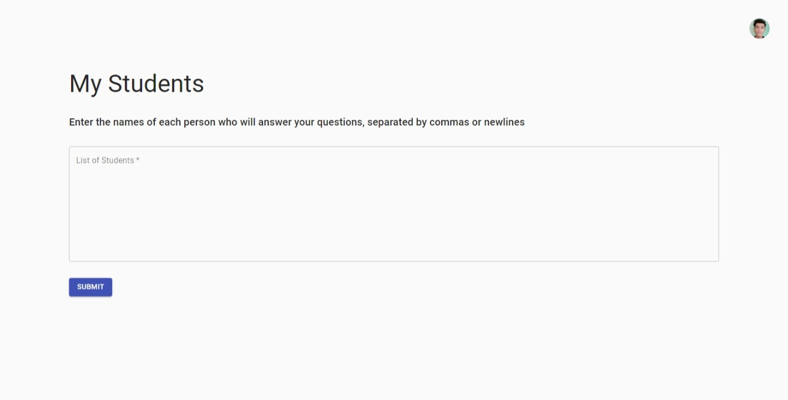
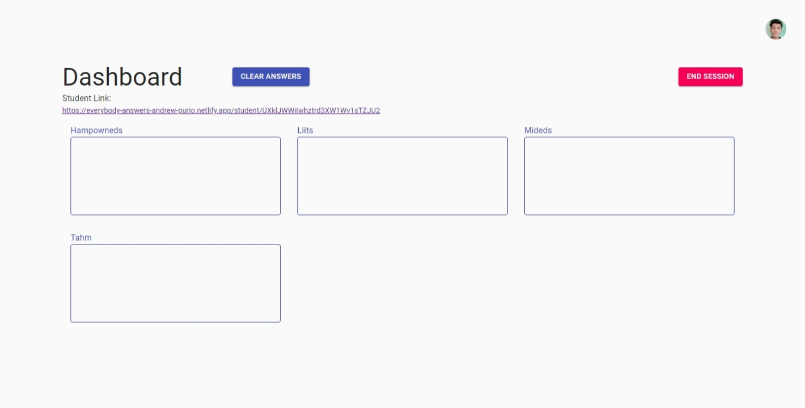
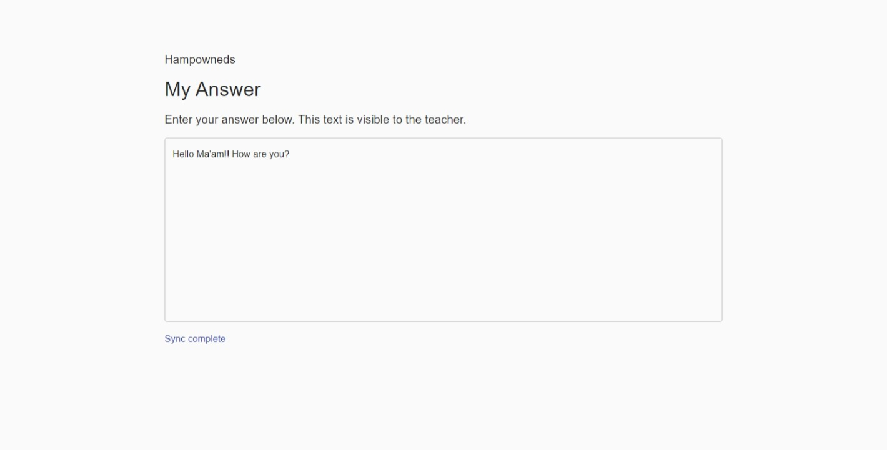
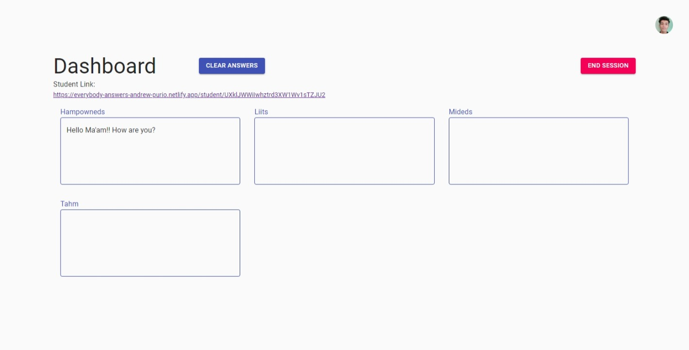

<!--
**JohnAndrewPurio/JohnAndrewPurio** is a ✨ _special_ ✨ repository because its `README.md` (this file) appears on your GitHub profile.

Here are some ideas to get you started:

- 🔭 I’m currently working on ...
- 🌱 I’m currently learning ...
- 👯 I’m looking to collaborate on ...
- 🤔 I’m looking for help with ...
- 💬 Ask me about ...
- 📫 How to reach me: ...
- 😄 Pronouns: ...
- ⚡ Fun fact: ...
-->

### Hello there, My name is Andrew Purio 👋

- 💯 Full-Stack Web Developer
- 🧐 Electronics Enthusiast
- ⚡ Electrical Engineering Student

I am Andrew Purio, a full-stack web developer here in the Philippines, and is an electronics enthusiast which also lead me to this vast field of web development. I love learning and grasping the concept of things or subjects that I find fascinating but is quite unfamiliar to me.

I am adept at creating web applications using the MERN stack but am also willing to learn other technological tools or stacks that can help expand my knowledge and further hone my skills. Some of the technological stacks that I am quite used to are:

- HTML, CSS, and JS
- MongoDB(Mongoose) 
- ExpressJS
- ReactJS
- NodeJS
- Material UI
- Redux
- Firebase Authentication and Databases

There are also other tools that I have used like:

- Chakra UI
- JWT (For authentication and authorization)

   
# Project Showcase:

## Quiz App

**Tools or APIs used:**
- React
- React Router
- Trivia API [(Open Trivia Database)](https://opentdb.com/api_config.php)
- CSS

An quiz web application that utilizes **Open Trivia Database** to showcase their rich list of multiple-choices type of questions that tests your general knowledge on several topics you can choose from.

- 🏠 Home Page

- 📜 Quiz Page

- ✔ Correct Answer

- 🔚 Results Page

   

### Here is the [link](https://quiz-app-andrew-purio.netlify.app/) if you want to check it out~ 🎉🎉

   

## Movies App

This is a web application that display the **top 20 trending movies** in which you can click to each movie card which will then redirect you to the details of the clicked movie and where you can also click to be redirected to **watch the trailer** of the said movie.

- 🗃 Movie Cards

   

- ❕ Movie Detail

   

### Another [link](https://movies-app-andrew-purio.netlify.app/) for you to check out 😁

   

## Memory Game

A fun time-based memory game that tests puts your short-term memory to the test. Match the pair of fruits so that you can earn a point while you chase the ticking of the clock.

- Game Start

   

- In Game

   

- Almost There

 

- 87 seconds... Not bad 🤣

 

### Can you beat my time? ⌚ Click [here](https://memory-game-andrew-purio.netlify.app/) to find out

   

## Everyone Answers

**Tools or APIs used:**
- React
- Firebase Authentication
- Firestore Database
- Material UI

An app that was created to help teachers get instant responses from students in a live online class. Teachers can create a session, add students, and can share a unique link with the students. When a student opens the portal and typed something in the text area, it synchronizes and appears on the teacher's dashboard.

- Log In Page

 

- Add Students Page

 

- Teacher's Dashboard

 

- Student's Link

- Student's Answer Page

- Synced Answers in the Teacher's Dashboard

### Here's the [link](https://everybody-answers-andrew-purio.netlify.app/) if you want to try it out.

   

## Poster: A Social Media App

A full-stack application built from scratch using MongoDB, Express, and NodeJS for the backend and React and ChakraUI for the frontend. It uses JSON Web Tokens (JWT) and cookies for user authentication and authorization.

- Sign Up Page

